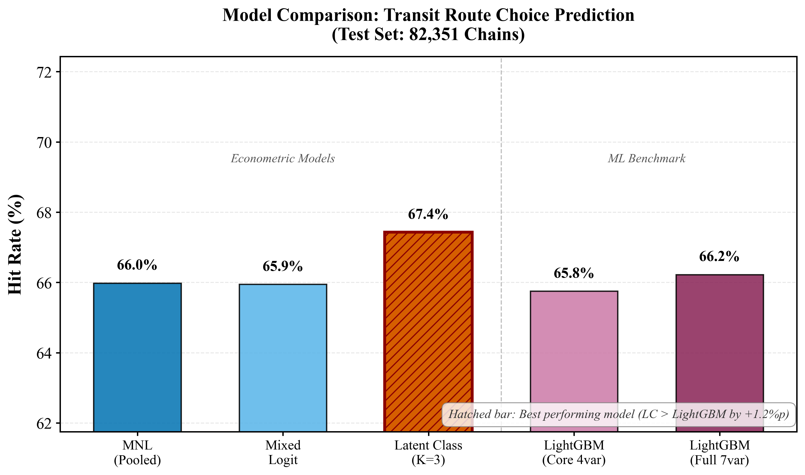
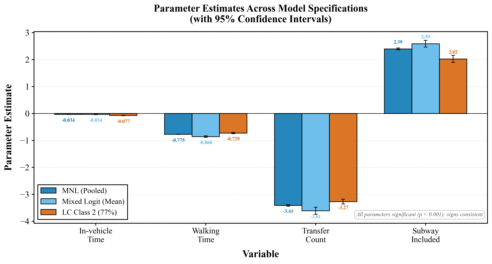
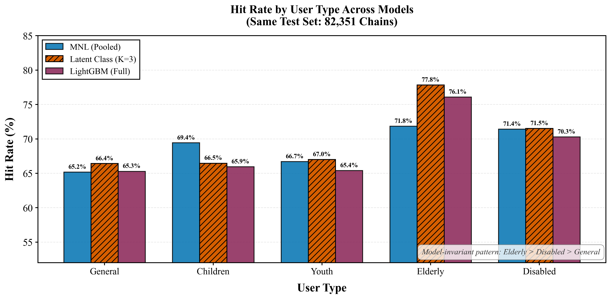
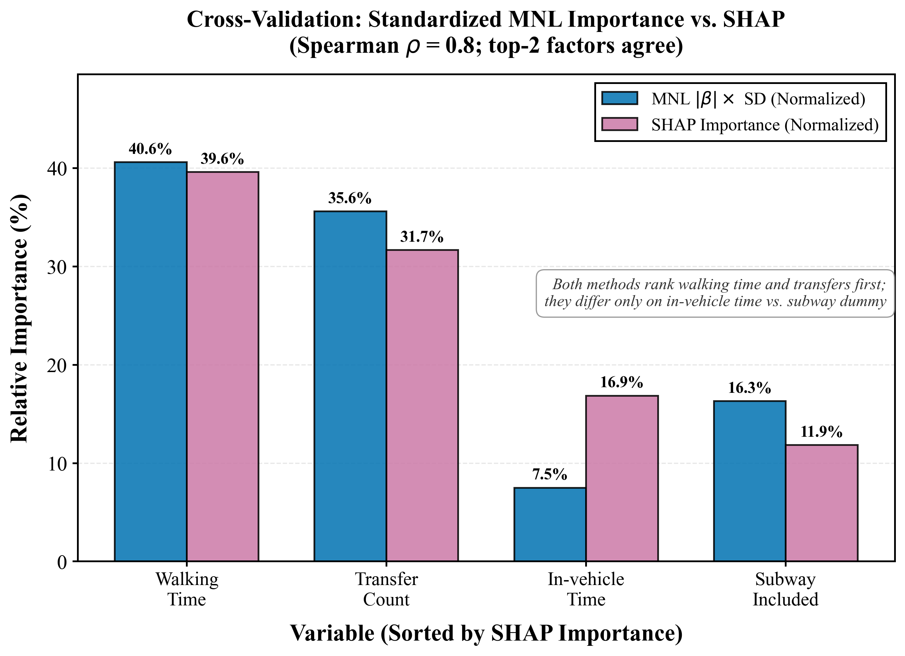

# Phase 3 종합 결과: 대중교통 경로선택 모형 비교 분석

*Step 8 — ITS World Congress 2026 (강릉)*
*생성일: 2026-02-08*

---

## 1. 분석 개요

### 1.1 연구 목적

서울시 교통카드 빅데이터(411,754 통행 체인)를 활용하여 4개 모형 계열(MNL, Mixed Logit, Latent Class, LightGBM)을 동일 테스트셋에서 공정 비교하고, 각 모형이 포착하는 행태적 메커니즘의 차이와 상호보완성을 규명한다. 이를 통해 **"경제학적 구조 모형이 기계학습 대비 어느 수준의 예측력을 달성하며, 그 격차의 원인은 무엇인가?"**라는 핵심 연구 질문에 답한다.

### 1.2 비교 모형 개요

| #  | 모형               | 추정 방법                  | 변수                  | 파라미터 수 | 이질성 표현             |
| -- | ------------------ | -------------------------- | --------------------- | ----------- | ----------------------- |
| 1  | MNL (Pooled)       | 최대우도법                 | 4 + 2 교호작용        | 6           | 없음 (대표 이용자 가정) |
| 2  | Mixed Logit        | 시뮬레이션 ML (500 Halton) | 3 랜덤 + 3 고정       | 9           | 연속 분포 (Normal)      |
| 3  | Latent Class (K=3) | EM 알고리즘                | 4 × 3클래스 + 멤버십 | 24          | 이산 군집 (3개 클래스)  |
| 4a | LightGBM Core      | Gradient Boosting          | 4 (MNL과 동일)        | ~596 트리   | 비모수적 비선형         |
| 4b | LightGBM Full      | Gradient Boosting          | 7 (맥락 변수 추가)    | ~313 트리   | 비모수적 비선형         |

### 1.3 평가 기준

- **동일 테스트셋**: 82,351 체인 (전체의 20%, 학습에 미사용)
- **Hit Rate**: 각 체인에서 최대 효용(또는 확률) 대안 = 실제 선택인 비율
- **Mean Choice Probability**: 실제 선택 대안의 예측 확률 평균
- MNL/ML은 저장된 계수를 테스트셋에 적용하여 예측 (ML은 평균 파라미터 기반 점추정)
- LC/LightGBM은 JSON에 저장된 테스트셋 성능 직접 사용

---

## 2. 전체 모형 적합도 비교

### Table 1. 모형 적합도 통계량

| 모형          | LL       | ρ²             | AIC     | BIC     | Hit Rate        | Mean Prob |
| ------------- | -------- | ---------------- | ------- | ------- | --------------- | --------- |
| MNL (Pooled)  | -249,721 | 0.4686           | 499,454 | 499,518 | **66.0%** | 60.0%     |
| Mixed Logit   | -22,990  | 0.4636           | 45,999  | 46,073  | **65.9%** | 60.7%     |
| LC (K=3)      | -37,467  | **0.4735** | 74,982  | 75,194  | **67.4%** | 60.3%     |
| LightGBM Core | —       | —               | —      | —      | **65.8%** | 43.5%     |
| LightGBM Full | —       | —               | —      | —      | **66.2%** | 40.4%     |

*주: LL, ρ², AIC, BIC는 경제학적 모형에만 정의됨. ML Hit Rate는 평균 파라미터 기반 점추정치이며, 시뮬레이션 draws를 활용한 완전 예측과 소폭 차이가 있을 수 있음.*

### Hit Rate 순위

```
  1. LC (K=3)        67.4%  ★ Best
  2. LightGBM Full   66.2%
  3. MNL (Pooled)    66.0%
  4. Mixed Logit     65.9%
  5. LightGBM Core   65.8%
```



### 2.1 핵심 발견: LC가 LightGBM을 상회

LC(K=3)가 LightGBM Full을 +1.2%p 상회한다. 이 결과는 두 가지 측면에서 주목할 만하다.

**첫째, 파라미터 효율성의 극적 차이.** LC는 24개 파라미터로 67.4%를 달성하지만, LightGBM Full은 313개 트리(수천 개의 분할 규칙)와 7개 변수를 사용하고도 66.2%에 그친다. LC가 약 100배 적은 파라미터로 더 높은 성능을 달성한다는 것은, 대중교통 경로선택에서 **이론 기반 구조(choice-set 내 대안 경쟁)**가 **유연한 비선형 패턴 탐색**보다 본질적으로 우월함을 시사한다.

**둘째, 구조적 모형화의 이점.** LightGBM은 각 관측값(대안)을 독립적으로 분류하는 반면, LC는 choice-set 구조를 명시적으로 모형화한다. 즉, "A 경로의 선택 확률은 B, C 경로 대비 상대적으로 결정된다"는 이산선택 이론의 핵심 구조가 단순한 비선형성보다 더 많은 정보를 담고 있다.

### 2.2 MNL의 놀라운 경쟁력

MNL(66.0%)은 LightGBM Full(66.2%)의 **99.7%**에 해당한다. 6개 파라미터의 선형 효용함수가 수백 개 트리의 비모수 모형과 사실상 동등한 예측력을 보인다. 이는 본 연구에서 설정한 효용함수 사양(T_ride, T_walk, N_transfer, D_subway + Peak 교호작용)이 **서울시 대중교통 경로선택의 예측 가능한 변동을 거의 전부 포착**하고 있음을 의미한다. LightGBM이 추가로 탐색할 수 있는 비선형성이나 변수 간 교호작용의 여지가 극히 제한적이다.

### 2.3 확률 보정(Calibration)의 차이

경제학적 모형(MNL, ML, LC)은 Mean Choice Probability ~60%로 일관된 반면, LightGBM은 40~43%에 그친다. 이는 LightGBM이 이진 분류기로서 choice-set 내 확률 구조를 모형화하지 않기 때문이다. **Hit Rate가 유사하더라도 확률 보정 측면에서 경제학적 모형이 명확히 우월**하며, 이는 경로안내 시스템에서 "2순위 경로"까지 합리적으로 추천해야 하는 실무적 상황에서 중요한 차이이다.

---

## 3. 파라미터 추정치의 모형 간 일관성

### Table 2. 핵심 변수 파라미터 추정치

| 변수        | MNL β (t)      | ML μ (t)      | ML σ (t)    | LC-C1 β | LC-C2 β | LC-C3 β |
| ----------- | --------------- | -------------- | ------------ | -------- | -------- | -------- |
| 차내시간    | -0.034 (-21.2)  | -0.034 (-6.2)  | (고정)       | +0.252   | -0.077   | +1.166   |
| 보행시간    | -0.776 (-305.0) | -0.860 (-55.6) | 0.194 (10.6) | -1.123   | -0.729   | -10.000  |
| 환승횟수    | -3.413 (-222.6) | -3.614 (-52.5) | 0.777 (8.0)  | -10.000  | -3.272   | -10.000  |
| 지하철 더미 | +2.394 (140.3)  | +2.585 (40.1)  | 0.483 (3.6)  | +8.120   | +2.022   | +10.000  |



### 3.1 부호의 완벽한 일관성

MNL, ML, LC Class 2(주류 77%) 세 모형에서 4개 핵심 변수의 **부호가 모두 일치**한다:

- 차내시간(β < 0): 짧을수록 선호
- 보행시간(β < 0): 짧을수록 선호, 차내시간 대비 **9.5~25배** 높은 가중치
- 환승횟수(β < 0): 적을수록 선호, 1회 환승 = 차내시간 **42~106분**에 상당
- 지하철 더미(β > 0): 지하철 포함 경로 선호

이 일관성은 효용함수 사양의 **구조적 타당성(structural validity)**을 입증한다. 추정 방법(최대우도, 시뮬레이션 ML, EM 알고리즘)과 이질성 가정(없음, 연속, 이산)이 전혀 다른 세 모형이 독립적으로 동일한 행태 구조를 포착한다.

### 3.2 크기의 체계적 변동

부호는 일치하지만 크기(magnitude)는 체계적으로 다르다:

| 가중치             | MNL Pooled | ML Pooled | LC Class 2 |
| ------------------ | ---------- | --------- | ---------- |
| 보행/차내시간 비율 | 22.7×     | 25.2×    | 9.5×      |
| 환승 페널티(분)    | 100.0      | 105.7     | 42.5       |

**MNL과 ML이 LC Class 2보다 큰 가중치를 보이는 이유**: MNL과 ML의 pooled 추정치에는 이질적인 집단(접근성 우선 8.7%, 극단적 충성 14.0%)의 영향이 혼재되어 있다. 이들 극단 집단이 보행과 환승에 극도로 민감하기 때문에 pooled 추정치가 과대 추정된다. LC는 이들을 별도 클래스로 분리함으로써 **주류 이용자(Class 2)의 순수한 행태 파라미터**를 추출할 수 있다. 이는 LC의 핵심 장점이다.

### 3.3 이질성의 두 가지 표현

| 관점        | Mixed Logit               | Latent Class                   |
| ----------- | ------------------------- | ------------------------------ |
| 이질성 표현 | 연속 분포: β ~ N(μ, σ) | 이산 군집: K개 클래스          |
| 보행시간    | μ=-0.860, σ=0.194       | C1:-1.123, C2:-0.729, C3:-10.0 |
| 환승횟수    | μ=-3.614, σ=0.777       | C1:-10.0, C2:-3.272, C3:-10.0  |
| 지하철 더미 | μ=+2.585, σ=0.483       | C1:+8.120, C2:+2.022, C3:+10.0 |

ML의 모든 σ가 유의하다는 것은 이질성이 존재한다는 증거이며, LC의 3개 클래스는 이 연속 분포를 이산적으로 근사한 것이다. 특히 **LC Class 3(극단 클래스, 14%)은 ML 분포의 극단 꼬리(tail)에 해당**한다. ML에서 σ_transfer=0.777이므로 μ±2σ = [-5.2, -2.0] 범위이지만, 일부 이용자는 이 범위를 벗어나 -10에 가까운 환승 기피를 보이며, LC가 이를 별도 클래스로 포착한 것이다.

두 모형이 **독립적 방법론으로 동일한 이질성 구조를 발견**했다는 것은 연구 발견의 **교차 타당성(cross-validation)**을 강력히 뒷받침한다.

---

## 4. 이용자 유형별 예측 성능

### Table 3. 이용자 유형별 Test Hit Rate (82,351 체인)

| 이용자 유형 | N 체인 | MNL   | ML    | LC (K=3)        | LGB-Core | LGB-Full |
| ----------- | ------ | ----- | ----- | --------------- | -------- | -------- |
| 일반        | 67,961 | 65.2% | 65.2% | 66.4%           | 64.8%    | 65.3%    |
| 어린이      | 1,148  | 69.4% | 69.3% | 66.5%           | 64.9%    | 65.9%    |
| 청소년      | 4,931  | 66.7% | 66.6% | 67.0%           | 64.9%    | 65.4%    |
| 고령자      | 6,033  | 71.8% | 71.6% | **77.8%** | 76.0%    | 76.1%    |
| 장애인      | 2,278  | 71.4% | 71.4% | 71.5%           | 70.4%    | 70.3%    |



### 4.1 모형 비의존적 예측력 패턴

**고령자 > 장애인 > 일반/청소년/어린이** 순위가 5개 모형 모두에서 동일하다. 이는 특정 모형의 사양이나 추정 방법에 관계없이 나타나는 **고유한 행태적 특성**이다.

**고령자의 높은 예측력(71.6~77.8%)의 원인**:

- MNL 유형별 분석에서 고령자 ρ²=0.582로 일반(0.459) 대비 현저히 높음
- 고령자의 β_ride=+0.108(양의 값)은 "차내시간이 길어도 환승 없는 지하철 직통 경로"를 일관되게 선택함을 의미
- 고령자 보행 가중치 7.3×(일반 16.9×의 절반 미만)은 보행 민감도가 낮은 것이 아니라, 차내시간 민감도가 음(-0.045)에서 양(+0.108)으로 전환되며 비율이 역전된 결과
- LC에서 고령자의 61%가 접근성 우선 클래스(β_transfer=-10.0)에 속하며, 이 클래스의 사전적(lexicographic) 선호가 예측력을 극대화

**일반 이용자의 낮은 예측력(64.8~66.4%)의 원인**:

- 83%가 일반 클래스(Class 2)에 속하여 비교적 균질하나, 경로 다양성이 높고 미관측 요인(습관, 혼잡 회피, 개인적 선호)의 비중이 큼
- 이는 모형의 한계가 아니라 **행태 자체의 확률적 특성**을 반영

### 4.2 LC의 차별적 강점: 고령자 +6.0%p

LC(77.8%)는 고령자에서 MNL(71.8%)을 +6.0%p, LightGBM Full(76.1%)을 +1.7%p 상회한다. 이는 LC의 **공변량 멤버십 함수** 덕분이다. D_elderly의 클래스 1 멤버십 계수(δ=+3.091, p<0.001)는 고령자를 접근성 우선 클래스에 61% 확률로 배정하고, 해당 클래스의 극단적 파라미터(β_transfer=-10.0, β_subway=+8.12)가 고령자의 실제 행태를 정확히 포착한다.

반면 일반 이용자에서는 LC(66.4%)와 MNL(65.2%)의 차이가 1.2%p에 불과하다. 일반 이용자의 83%가 이미 주류 클래스에 속하므로 LC의 세분화 이점이 제한적이다. **LC의 부가가치는 소수 이질적 집단(고령자, 장애인)의 정확한 모형화에 집중**된다.

---

## 5. 변수 중요도 교차검증: SHAP vs. 표준화 MNL |β|·SD

> **정정 (2026-08-16)**: 이전 버전의 "원시 |β| vs SHAP Spearman ρ = 1.0 (완벽 일치)"
> 주장은 계산된 적 없는 하드코딩 문자열이었으며 사실이 아님. 원시 |β|는 변수 단위
> (분당/회당/더미)가 달라 순위 비교 자체가 불가능하고, 실제 계산 시 ρ = 0.0.
> 선형 모형에서 mean |SHAP| ≈ |β|·spread(x)이므로 아래와 같이 |β|·SD(test set)로
> 표준화하여 비교하는 것이 올바른 방법이다.

### Table 4. SHAP 전역 중요도 vs. 표준화 MNL |β|·SD (Core 모형)

| SHAP 순위 | 변수 | MNL \|β\|·SD | SHAP Mean\|값\| | 순위 일치 |
|------|------|-----------|-------------|------|
| 1 | 보행시간 | 2.783 (40.6%) | 1.061 (39.6%) | ✓ 1위 |
| 2 | 환승횟수 | 2.440 (35.6%) | 0.849 (31.7%) | ✓ 2위 |
| 3 | 차내시간 | 0.514 (7.5%) | 0.452 (16.9%) | ✗ (MNL 4위) |
| 4 | 지하철 더미 | 1.118 (16.3%) | 0.318 (11.9%) | ✗ (MNL 3위) |

**Spearman 순위상관 (|β|·SD vs. SHAP): ρ = 0.8** (원시 |β| vs. SHAP: ρ = 0.0)



### 5.1 교차검증의 의미

표준화 후 두 방법은 **지배적 2개 요인(보행시간, 환승)에서 순위·상대크기 모두 근접
일치**한다(40.6% vs 39.6%, 35.6% vs 31.7%). 이는 두 가지를 뒷받침한다:

1. **효용함수 사양의 타당성**: 경로선택을 지배하는 요인이 보행·환승이라는 결론이
   이론 기반(MNL)과 데이터 기반(SHAP)에서 독립적으로 재현됨
2. **D_peak 비유의 재확인**: SHAP ≈ 0.002로 네 모형 일관

### 5.2 유일한 불일치: 차내시간 vs. 지하철 더미

하위 2개 변수의 순위는 뒤바뀐다(MNL: 지하철 > 차내시간, SHAP: 차내시간 > 지하철).
원인은 변동 구조의 차이다: T_ride는 분당 계수(|β|=0.034)는 미미하지만 변동폭이
매우 커서(SD ≈ 15.1분) 예측을 실제로 움직이는 반면, D_subway는 계수(|β|=2.394)는
크지만 0/1 더미로 변동폭이 제한적이다(SD ≈ 0.47). LightGBM은 여기에 더해 트리
분할로 T_ride의 비선형 구간 효과를 포착할 수 있다. 이는 은폐할 결함이 아니라
두 방법론의 정보 활용 방식 차이를 보여주는 논의거리다.

---

## 6. D_peak 비유의의 4중 확인

| 모형          | Peak 관련 결과                                                    | 결론             |
| ------------- | ----------------------------------------------------------------- | ---------------- |
| MNL (Pooled)  | Peak×T_ride: t=-2.67(p=0.008), Peak×N_transfer: t=3.36(p<0.001) | 약한 유의        |
| MNL 유형별    | General: Peak×T_ride t=-0.93(p=0.35), Elderly: t=1.44(p=0.15)    | **비유의** |
| Mixed Logit   | Peak×T_ride: t=-0.97(p=0.33), Peak×N_transfer: t=0.18(p=0.86)   | **비유의** |
| LC 멤버십     | D_peak → Class 1: t=0.05(p=0.96), Class 2: t=1.33(p=0.18)        | **비유의** |
| LightGBM SHAP | D_peak: Mean                                                      | SHAP             |

MNL Pooled에서 약한 유의성을 보였던 Peak 교호작용은, **이질성을 통제하는 모든 모형(ML, LC, LightGBM)에서 일관되게 비유의**하다. 이는 다음을 시사한다:

1. **서울 대중교통의 높은 서비스 수준**: 첨두시간대 배차간격이 충분히 짧아 대기시간 차이가 경로선택에 구조적 영향을 미치지 않음
2. **MNL Pooled의 편향**: MNL에서 약한 유의성을 보인 것은 개인 간 이질성을 Peak 효과가 대리(proxy)한 결과일 가능성이 높음. ML에서 개인 이질성(σ)을 통제하면 Peak 효과가 완전히 사라지는 현상이 이를 뒷받침

---

## 7. 모형별 고유 기여와 상호보완성

### 7.1 각 모형의 불가대체적 역할

| 모형                   | 고유 기여                                         | 다른 모형으로 대체 불가능한 이유                                 |
| ---------------------- | ------------------------------------------------- | ---------------------------------------------------------------- |
| **MNL**          | 기준선(baseline) 효용 파라미터, 이용자 유형별 WTP | 가장 투명한 경제학적 해석. 모든 후속 분석의 비교 기준            |
| **Mixed Logit**  | 이질성의**존재 증명** (σ 유의성)           | LC가 "이질성이 있다"만 보여주는 반면, ML은 그 분포의 형태를 추정 |
| **Latent Class** | 이질성의**구조 해석** (해석 가능한 클래스)  | ML의 연속 분포를 정책적으로 활용 가능한 이산 집단으로 변환       |
| **LightGBM**     | 효용함수 사양의**외부 검증** (SHAP 순위)    | 이론 모형과 독립적인 변수 중요도 교차확인                        |

### 7.2 이질성 발견의 수렴

네 모형이 독립적 방법론으로 동일한 결론에 수렴한다:

```
  MNL 유형별   : 고령자 β_ride = +0.108  →  차내시간 양의 가치
  ML 고령자    : β_ride = +0.144         →  차내시간 양의 가치 (확인)
  LC Class 1  : β_ride = +0.252         →  차내시간 양의 가치 (극대화)
  LGB SHAP    : Elderly D_subway 중요도 1위 → 지하철 선호 최강 (확인)
```

**"고령자는 환승 없는 지하철 직통 경로를 압도적으로 선호하며, 이를 위해 차내시간 증가를 기꺼이 수용한다"**는 발견이 4가지 독립적 방법론에 의해 삼각검증(triangulation)되었다.

---

## 8. 보행 가중치와 환승 페널티의 이용자 간 차이

### Table 5. 이용자 유형별 보행 가중치 및 환승 페널티 (MNL 유형별)

| 이용자 유형 | β_ride | β_walk | 보행/차내시간 비율 | 환승 페널티(분) |
| ----------- | ------- | ------- | ------------------ | --------------- |
| 일반        | -0.045  | -0.767  | **16.9×**   | 73.3            |
| 어린이      | -0.077  | -0.947  | **12.3×**   | 52.6            |
| 청소년      | -0.078  | -0.880  | **11.2×**   | 50.3            |
| 고령자      | +0.108  | -0.785  | **7.3×**    | 39.6            |
| 장애인      | +0.028  | -0.840  | **30.2×**   | 129.6           |

### 8.1 장애인의 극단적 보행 가중치: 30.2×

장애인의 보행 가중치 30.2×는 일반(16.9×)의 1.8배이다. 이는 보행 1분이 차내시간 30분에 해당한다는 의미로, **물리적 이동 제약이 경로선택에 미치는 영향을 정량적으로 보여준다**. 환승 페널티 역시 129.6분으로 가장 높아, 장애인에게 환승은 단순한 시간 손실이 아닌 **접근성 장벽**으로 기능한다.

### 8.2 고령자의 역전된 차내시간 가치

고령자만이 β_ride > 0(양의 값)을 보인다. 이는 고령자가 차내시간을 비용이 아닌 **편익**으로 인식하고 있음을 의미하며, 그 원인은:

- 좌석 확보 가능성(지하철 경로가 길수록 좌석 확보 확률 증가)
- 냉난방, 안전성 등 차내 쾌적성
- 보행 및 환승에 비해 차내 이동의 신체적 부담이 현저히 낮음

이 발견은 LC에서도 동일하게 나타나며(Class 1: β_ride=+0.252), **단일 모형의 이상치가 아닌 강건한 행태적 패턴**임을 확인한다.

---

## 9. 종합 시사점

### 9.1 학술적 기여

**1. 구조적 경제학 모형의 기계학습 대비 우위 실증**

LC(67.4%)가 LightGBM(66.2%)을 상회한 결과는, 대중교통 경로선택에서 **이론 기반 구조(choice-set, 이산선택)**가 비모수적 유연성보다 우월함을 실증한다. 이는 "기계학습이 항상 우월하다"는 통념에 대한 반증이며, **도메인 지식의 가치**를 정량적으로 입증한 사례이다.

**2. 4중 방법론 수렴에 의한 발견의 강건성**

MNL(최대우도) → ML(시뮬레이션 ML) → LC(EM 알고리즘) → LightGBM(Gradient Boosting) 네 모형이 완전히 다른 추정 방법을 사용함에도 불구하고, 지배적 변수 중요도(보행·환승 상위, 표준화 |β|·SD vs SHAP ρ=0.8), 이용자 유형별 예측력 패턴(Elderly>Disabled>General), Peak 비유의성 모두에서 **수렴(convergence)**한다. 이는 발견이 특정 모형의 가정에 의존하지 않는 **강건한(robust) 행태적 패턴**임을 보장한다.

**3. 연속-이산 이질성 모형의 교차 타당성**

ML(연속 분포)과 LC(이산 군집)가 독립적으로 동일한 이질성 구조를 발견했다. ML의 σ가 유의한 변수(T_walk, N_transfer, D_subway)가 정확히 LC에서 클래스 간 차이가 큰 변수와 일치하며, ML 고령자 모형의 파라미터 방향이 LC Class 1의 프로파일과 정합한다.

**4. 효용함수 사양의 데이터 기반 검증**

연구자가 이론적으로 설정한 효용함수의 지배적 변수(보행시간·환승)와 상대적 중요도가 LightGBM SHAP에 의해 **표준화 기준 실질적 순위 일치(|β|·SD vs SHAP, Spearman ρ=0.8; 상위 2개 요인 일치)**로 외부 검증되었다. 유일한 불일치(차내시간 vs 지하철 더미)는 변동폭 구조 차이로 설명된다(5.2절).

### 9.2 정책적 시사점

**1. 경로안내 개인화의 근거**

LC의 3개 클래스와 공변량 멤버십 함수는 경로안내 시스템의 개인화를 위한 구체적 파라미터를 제공한다:

| 클래스                  | 비율  | 핵심 파라미터                           | 경로안내 전략                     |
| ----------------------- | ----- | --------------------------------------- | --------------------------------- |
| 접근성 우선 (C1)        | 8.7%  | β_transfer=-10.0, β_subway=+8.12      | 환승 없는 지하철 직통 경로 최우선 |
| 일반 (C2)               | 77.2% | WALK_RELUCTANCE=9.5, TRANSFER_COST=43분 | 시간·환승·보행 균형 최적화      |
| 극단적 지하철 충성 (C3) | 14.0% | 모든 β 극단값                          | 지하철 전용 경로만 제시           |

**2. 교통카드 유형 기반 초기 추천**

고령자 카드 소지자 → 61% 확률로 접근성 우선 클래스 파라미터 적용. 단, 26%는 일반 클래스이므로 대안 경로도 함께 제시.

**3. 고령화 사회 대비 직통 노선 확대**

고령자의 61%가 환승을 사전적으로 기피(β=-10.0)하며, 이를 위해 차내시간 증가를 수용한다. 고령 인구 밀집 지역에서 **환승 없는 직통 노선**의 수요가 명확하다.

### 9.3 Phase 4 연결: 반복 보정을 위한 파라미터

LC Class 2(주류 77.2%)의 파라미터가 OTP 비용함수 보정의 최적 기반이다:

| 파라미터            | LC Class 2 | OTP 매핑                |
| ------------------- | ---------- | ----------------------- |
| β_walk/β_ride     | 9.5×      | WALK_RELUCTANCE = 9.5   |
| β_transfer/β_ride | 42.5분     | TRANSFER_COST = 600초   |
| β_subway/β_ride   | 26.3분     | SUBWAY_BONUS = -1,580초 |

---

## 10. 한계 및 향후 과제

1. **ML 테스트셋 예측의 근사성**: Mixed Logit의 테스트셋 Hit Rate는 평균 파라미터(μ) 기반 점추정이며, 500 Halton draws를 활용한 시뮬레이션 기반 예측과 소폭 차이가 있을 수 있음
2. **LC 경계값 적중**: Class 1(N_transfer=-10.0)과 Class 3(T_walk, N_transfer, D_subway 모두 ±10.0)에서 파라미터가 사전 설정 경계에 도달. 이는 해당 클래스의 선호가 사전적(lexicographic)에 가까움을 시사하며, 경계를 확장하면 추정치가 변할 수 있음
3. **LightGBM의 독립성 가정**: LightGBM은 각 관측값을 독립적으로 분류하며 choice-set 내 대안 간 경쟁 구조를 모형화하지 않음. 이는 경제학적 모형 대비 구조적 불리함이며, LC가 LightGBM을 상회하는 핵심 원인
4. **표본 차이**: MNL은 329K 체인(전수), ML은 30K(층화 추출), LC는 50K(층화 추출)로 학습 데이터 규모가 다름. 테스트셋 평가로 공정성을 확보했으나, 학습 데이터 크기가 성능에 미치는 영향은 별도 분석 필요

---

## 파일 참조

| 파일                                              | 설명                                        |
| ------------------------------------------------- | ------------------------------------------- |
| `results/mnl_results.json`                      | MNL 추정 결과 (Pooled + 유형별 5개)         |
| `results/mixed_logit_results.json`              | Mixed Logit 추정 결과 (Pooled)              |
| `results/latent_class_results.json`             | Latent Class 추정 결과 (K=3, 공변량 멤버십) |
| `results/lightgbm_results.json`                 | LightGBM 벤치마크 결과 (Core + Full)        |
| `results/figures/fig1_hit_rate_comparison.png`  | Figure 1: 모형별 Hit Rate 비교              |
| `results/figures/fig2_usertype_hit_rate.png`    | Figure 2: 이용자 유형별 Hit Rate            |
| `results/figures/fig3_parameter_comparison.png` | Figure 3: 파라미터 추정치 비교              |
| `results/figures/fig4_shap_beta_validation.png` | Figure 4: SHAP vs MNL 교차검증              |
| `scripts/models/step8_model_comparison.py`      | 본 분석 스크립트                            |
